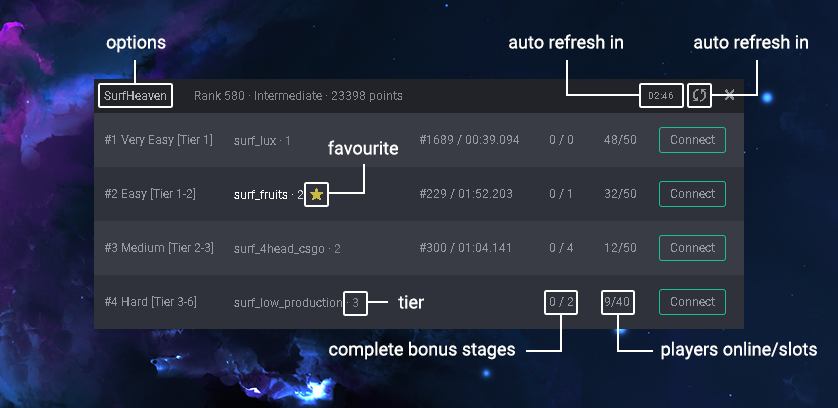

# SurfHeaven Server Browser
A server browser tool for SurfHeaven.

## Download
You can download a precompilled Windows package in the [releases page](https://github.com/Mazvy/surfheaven-server-browser/releases) or build the app yourself (instructions bellow).

## Configuration
**`playerID` should be loaded automatically. If not add it yourself in the options ui by clicking SurfHeaven in the top bar.**

Configuration can be done in the app or in the `config.json` file located in the root project directory

**playerID** `int`

Your steamid3 value. You can get this id on any steam id finder or on SurfHeaven by clicking on **My Profile** and copying your ID from the URL.

**forceShowAllServers** `boolean`

VIPs and top 250 surfers will **automatically** see all servers in the server browser. You can set this value to `true` if you want to see all servers.

## Manual installation
1. Install [node.js](https://nodejs.org/en/download/) and [npm](https://docs.npmjs.com/downloading-and-installing-node-js-and-npm) (npm is usually installed along with node.js automatically) 
2. Clone this repo
3. Run `npm install` to install dependencies
4. Run `npm start` to launch application
